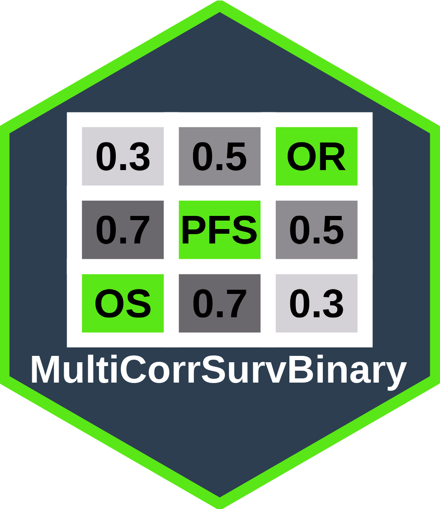

# MultiCorrSurvBinary 

[](https://github.com/gosukehommaEX/MultiCorrSurvBinary/actions)
[](https://CRAN.R-project.org/package=MultiCorrSurvBinary)

## Overview

MultiCorrSurvBinary is an R package for generating correlated time-to-event and binary outcomes in clinical trial simulations. It provides comprehensive tools for:

- Generating correlated overall survival (OS), progression-free survival (PFS), and objective response (OR) outcomes
- Supporting multiple treatment arms and subgroups
- Validating correlation bounds using Frechet-Hoeffding constraints
- Performing event-driven analyses with proper statistical testing
- Handling complex correlation structures using copulas

## Installation

You can install the development version from GitHub:

```r
# Install devtools if you haven't already
install.packages("devtools")

# Install MultiCorrSurvBinary
devtools::install_github("gosukehommaEX/MultiCorrSurvBinary")
```

## Key Features

### 1. Correlation Bound Validation
The package includes rigorous validation of correlation parameters against true Frechet-Hoeffding bounds using analytical integration.

### 2. Flexible Simulation Framework
- Single or multiple treatment arms
- Subgroup analyses
- Customizable outcome combinations (OS, PFS, OR)
- Proper handling of OS >= PFS constraints

### 3. Event-Driven Analysis
- Sequential analysis at predefined event numbers
- Multiple comparison adjustments
- Comprehensive statistical testing

## Quick Start

```r
library(MultiCorrSurvBinary)

# Example 1: Simple two-arm simulation
arm.params <- list(
  arm1 = list(
    mst.OS = 18, mst.PFS = 12, p.OR = 0.6, n = 200,
    rho.OS.PFS = 0.5, rho.OS.OR = 0.3, rho.PFS.OR = 0.4
  ),
  arm2 = list(
    mst.OS = 12, mst.PFS = 8, p.OR = 0.4, n = 200,
    rho.OS.PFS = 0.5, rho.OS.OR = 0.3, rho.PFS.OR = 0.4
  )
)

# Generate simulation data
sim_data <- rCorrSurvBinaryMultiArmSubgroup(
  nsim = 100,
  outcomes = c('OS', 'PFS', 'OR'),
  arm.params = arm.params,
  tau = 24,
  seed = 123
)

# Perform event-driven analysis with appropriate event numbers
analysis_results <- AnalysisCorrSurvBinary(
  data = sim_data,
  E = c(50, 100, 150),  # Event numbers appropriate for sample size
  prioritize = "OS",
  subgroup.prioritize = c("entire"),
  alternative = "greater"
)

# View results summary
summary(analysis_results)
```

## Functions

- `rCorrSurvBinary()`: Generate correlated outcomes for single population
- `rCorrSurvBinaryMultiArmSubgroup()`: Generate correlated outcomes for multiple arms/subgroups
- `CorrBounds()`: Validate correlation bounds using Frechet-Hoeffding constraints
- `TestsSurvBinary()`: Perform statistical tests
- `AnalysisCorrSurvBinary()`: Event-driven analysis framework

## Documentation

Detailed documentation and examples are available in the package vignettes:

```r
vignette("introduction", package = "MultiCorrSurvBinary")
vignette("examples", package = "MultiCorrSurvBinary")
```

## Citation

If you use this package in your research, please cite:

```r
citation("MultiCorrSurvBinary")
```

## License

This package is licensed under the MIT License.


## Author

Gosuke Homma (my.name.is.gosuke@gmail.com)
